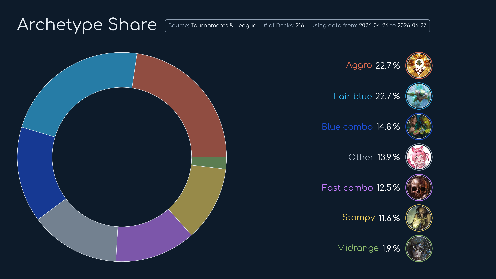
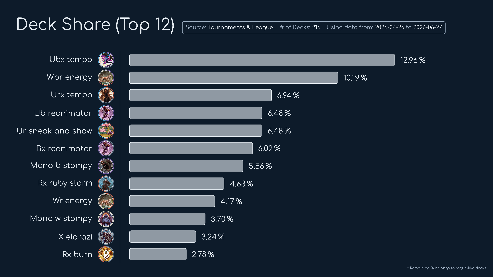
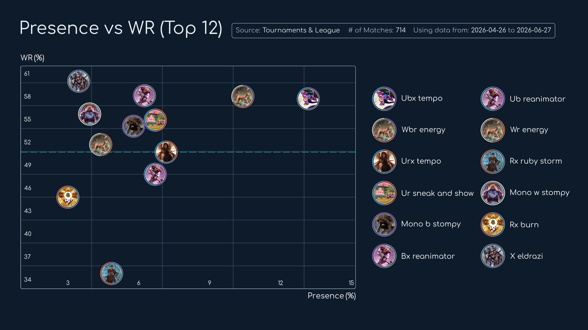
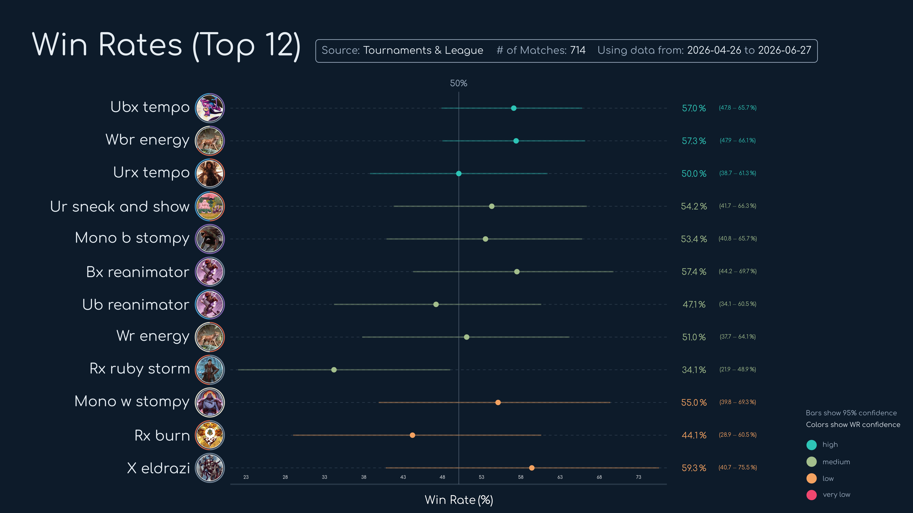
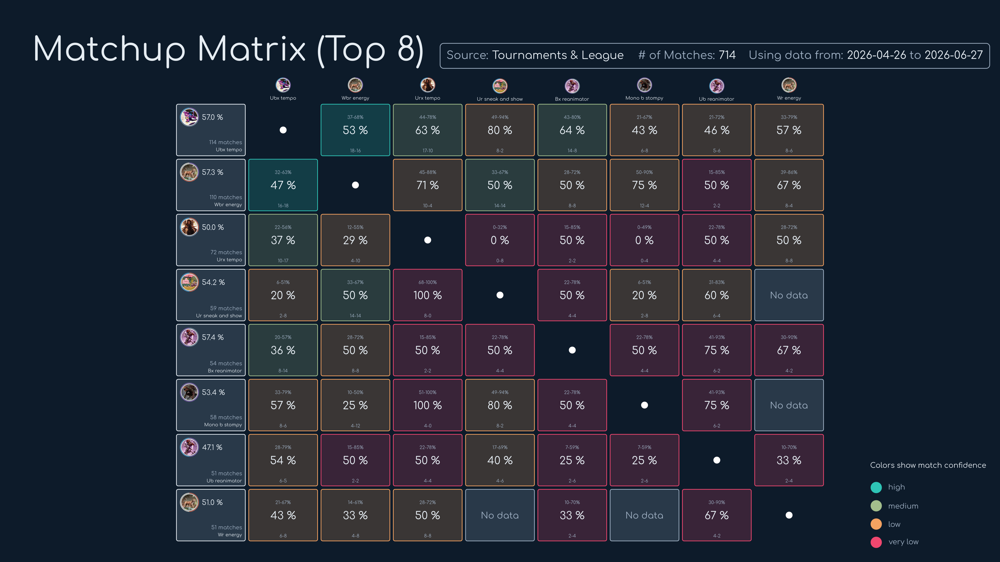
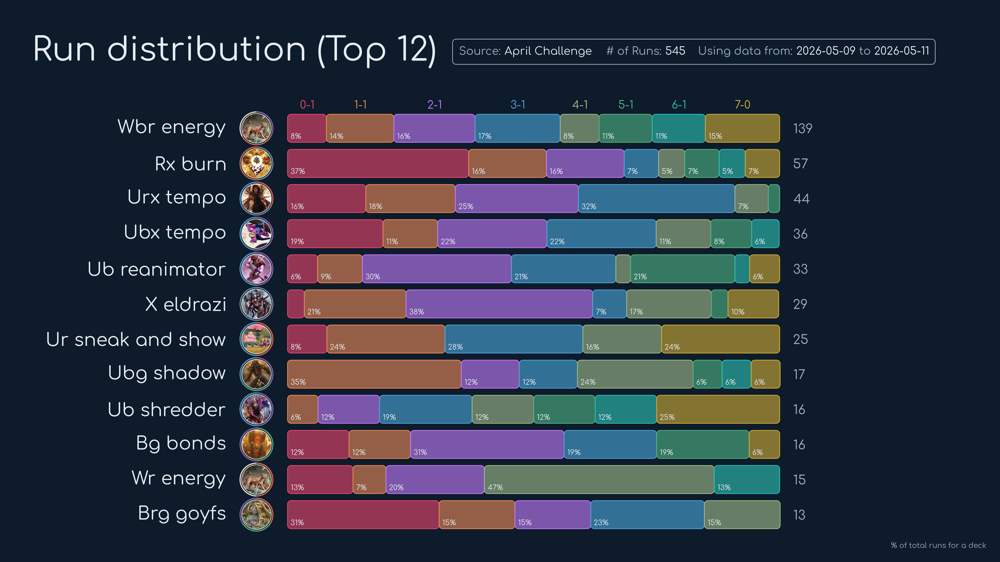

# MTGA Visualisation Tool

Package for clean, insightful dashboards targeting competitive MTG Arena analysis. Covers 2 of 3 layers in the `MTGA_DATA` environment: **data analysis** and **visualisation**.

See also: [mtga_data_bot](https://github.com/PanoPepino/mtga_data_bot) · [mtga_scraper](#)

*(exploratory notebooks and images shared upon request)*

## Architecture

```
MTGA_DATA environment
├── mtga_scraper        ← raw data collection from webpage
├── mtga_data_bot       ← raw data collection discord bot
└── mtga_viz (this)
    ├── analysis/       ← statistical processing
    └── visualisation/  ← Manim-based dashboards
```


## Analysis Layer

Supports two competitive modalities. ~75% of functions are modality-agnostic.

### General (both modalities)

- Deck/archetype frequency extraction for a given meta snapshot
- Win rate of top-N decks vs. full metagame with confidence intervals

### Tournament & League

- Match result matrix with confidence intervals
- Threshold validation for top-N deck inclusion

### Metagame Challenge

- Normalised metagame-run distribution for top-N decks
- Time series analysis across full event duration (includes trophy counter)


## Visualisation Layer

Built on **Manim**. Transforms analysis output into detailed dashboard components.

### General Plots

<p align="center">
  
  
</p>
<p align="center">
  
  
</p>

### Tournament & League

<p align="center">
  

</p>

### Metagame Challenge

<p align="center">
  
</p>

## Usage

> ⚠️ Under construction.


## Related Packages

| Package | Role |
|---|---|
| `mtga_scraper` | Scrapes raw match/event data |
| `mtga_data_bot` | Stores and pipelines structured data |
| `mtga_viz` (this) | Analysis + visualisation |


